# Trọ Tốt

Ứng dụng di động Flutter hỗ trợ tìm kiếm, quản lý và tương tác với các phòng trọ/nhà trọ. Dự án sử dụng Firebase cho xác thực, dữ liệu thời gian thực, thông báo và lưu trữ, kết hợp kiến trúc theo hướng Repository + BLoC để dễ mở rộng và bảo trì.

## Tính năng nổi bật

- Đăng nhập/đăng ký bằng Firebase Auth
- Đăng nhập bằng Google và Facebook
- Tìm kiếm và lọc phòng trọ
- Danh sách yêu thích
- Đặt lịch hẹn/xem phòng
- Đánh giá và nhận xét
- Thông báo đẩy qua Firebase Messaging
- Tải ảnh lên Firebase Storage
- Hỗ trợ bản đồ và định vị
- Lưu dữ liệu cục bộ bằng Hive

## Công nghệ sử dụng

- Flutter / Dart
- Firebase
  - Authentication
  - Firestore
  - Messaging
  - Storage
- BLoC / Cubit
- GoRouter
- Hive
- Google Maps / MapLibre
- Geolocator
- Dio

## Cấu trúc dự án

- `lib/core`: route, service và các phần lõi của ứng dụng
- `lib/features`: các module theo từng tính năng như auth, home, search, favorites, appointment, messages, profile, reviews
- `assets/screenshots`: ảnh minh họa giao diện ứng dụng
- `assets/icons`, `assets/images`, `assets/fonts`: tài nguyên giao diện và font

## Ảnh chụp màn hình

<table>
  <tr>
    <td>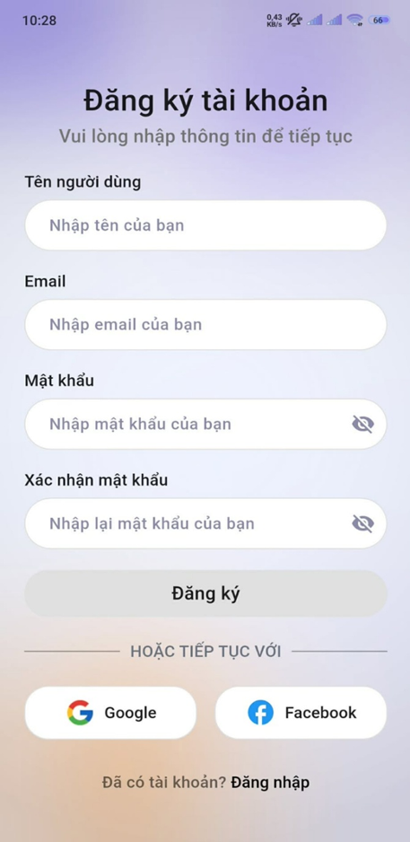</td>
    <td>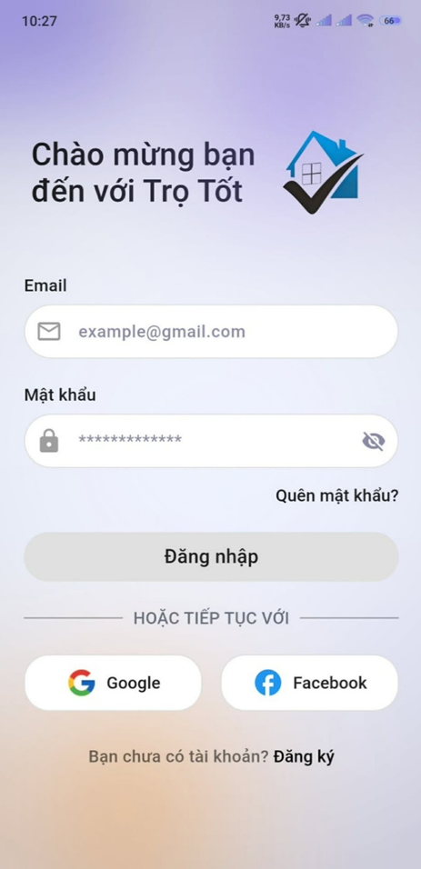</td>
    <td>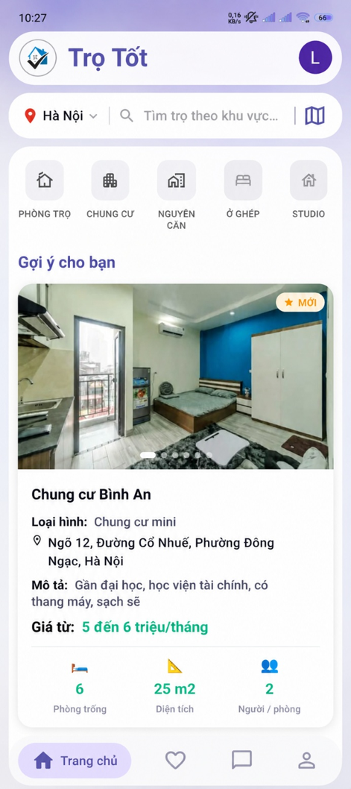</td>
  </tr>
  <tr>
    <td>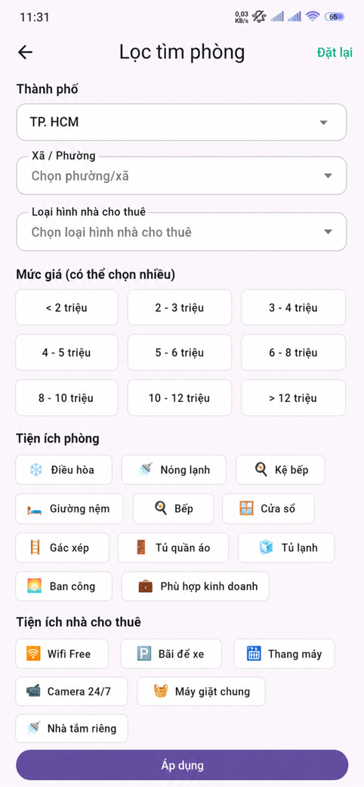</td>
    <td>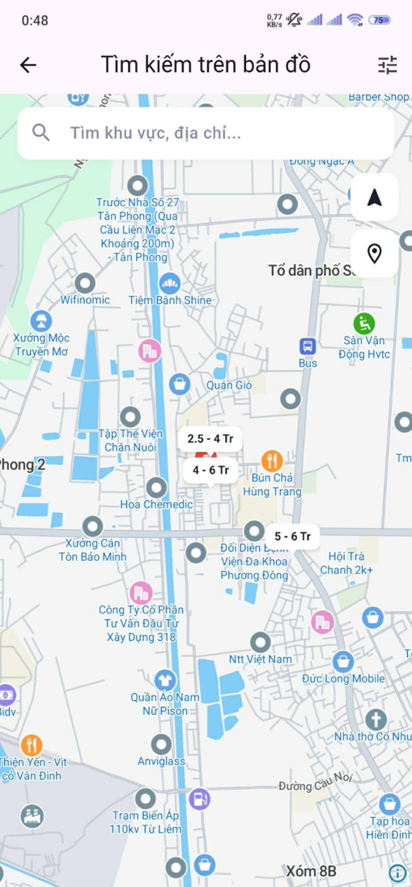</td>
    <td>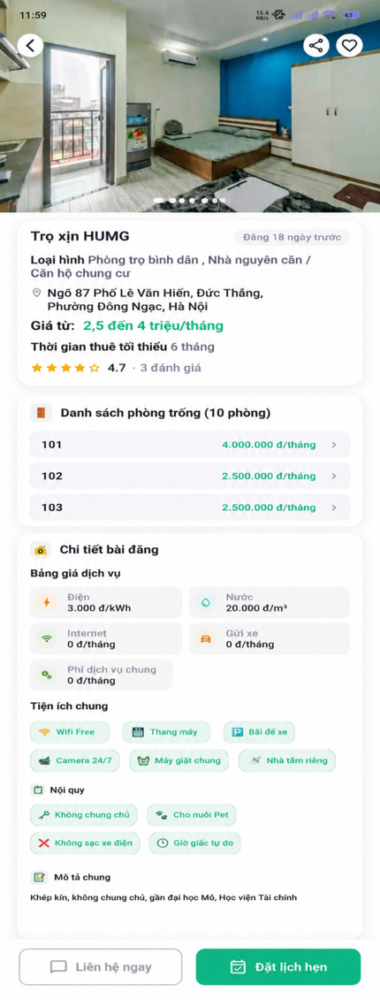</td>
  </tr>
  <tr>
    <td>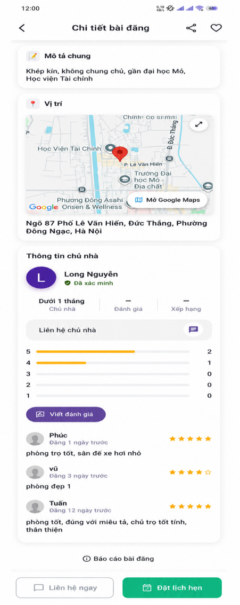</td>
    <td>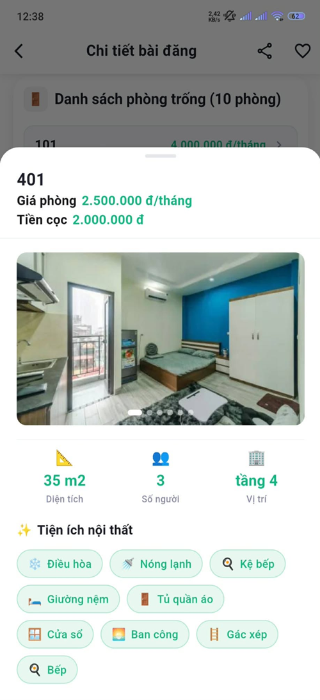</td>
    <td>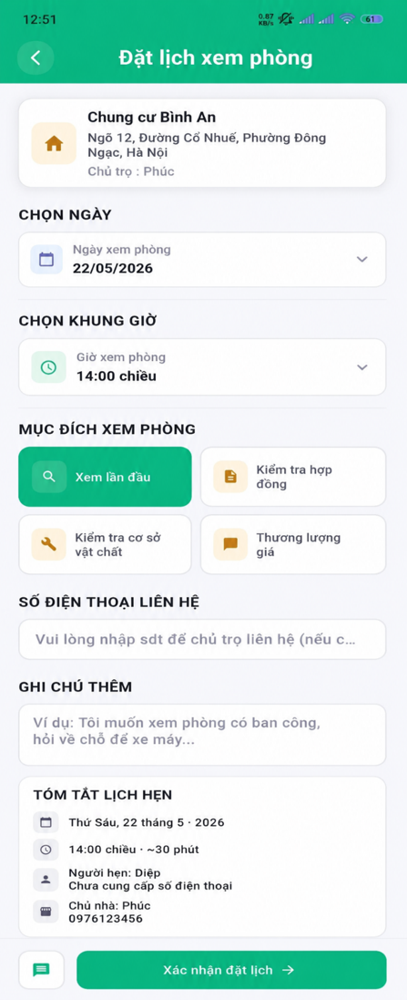</td>
  </tr>
  <tr>
    <td>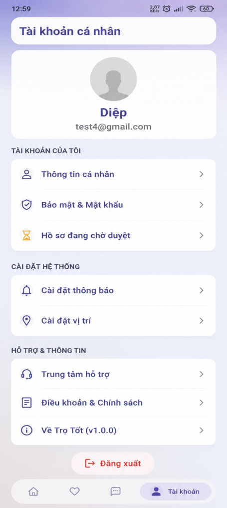</td>
    <td>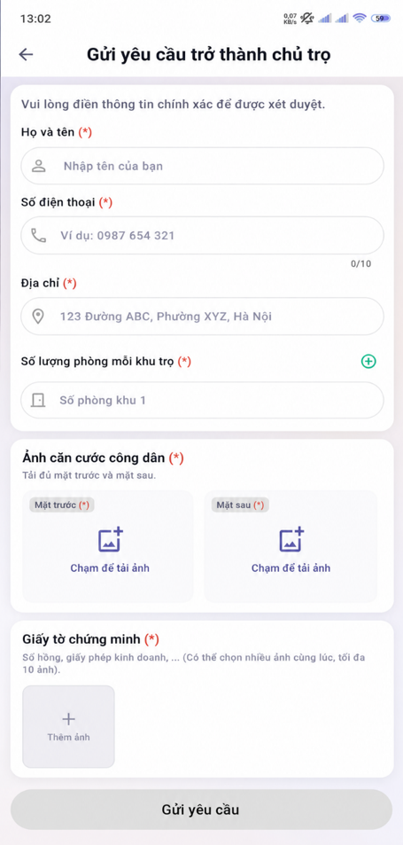</td>
    <td></td>
  </tr>
</table>

## Cài đặt và chạy

### 1. Clone dự án

```bash
git clone https://github.com/Nguyenlong270501/trotot.git
cd trotot
```

### 2. Cài đặt dependencies

```bash
flutter pub get
```

### 3. Cấu hình Firebase và Goong Map API key

Đảm bảo bạn đã cấu hình Firebase cho cả Android và iOS, đồng thời có file `firebase_options.dart` phù hợp với dự án và đẵ tạo API key tại Goong

### 4. Chạy ứng dụng

```bash
flutter run
```

## Ghi chú

- Ứng dụng đang được cấu hình chạy theo chiều dọc.
- Dự án dùng `flutter_native_splash` và `flutter_launcher_icons` cho splash screen và icon ứng dụng.
- Tài nguyên ảnh được khai báo trong thư mục `assets/`.

## Đóng góp

Nếu bạn muốn cải thiện dự án, hãy tạo pull request hoặc mở issue để trao đổi thêm.
